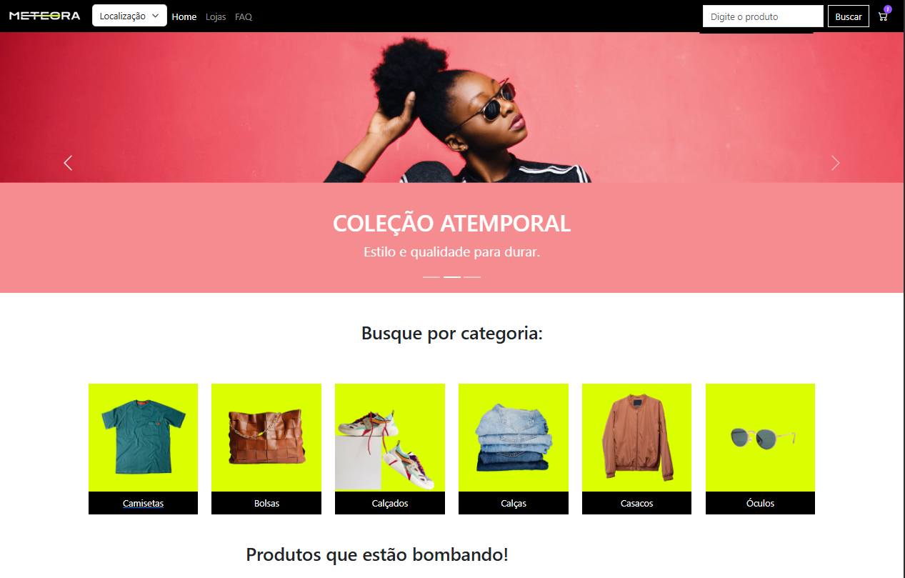

# Meteora - E-commerce

## 🔨 Funcionalidades do projeto

Loja de roupas virtual com opção de visualizar detalhes dos produtos, adicionar ao carrinho e remover do carrinho.

## ✔️ Técnicas e tecnologias utilizadas

  
  
  
  

## 🛠️ Abrir e rodar o projeto

Projeto da [Alura](https://cursos.alura.com.br/) durante a formação **UI para Devs: aprimorando projetos web com heurísticas** onde foi incrementado:

- Fornecer feedback imediato e informativo para ações do usuário, melhorando a clareza e a eficiência da comunicação.
- Implementar recursos de ajuda e documentação acessíveis e úteis para os usuários.
- Identificar e implementar melhorias na interface do usuário para promover uma experiência mais satisfatória e eficaz.

## 📁 Acesso ao projeto

<h2> 📞 Contato</h2>

 
  
  
   
  

